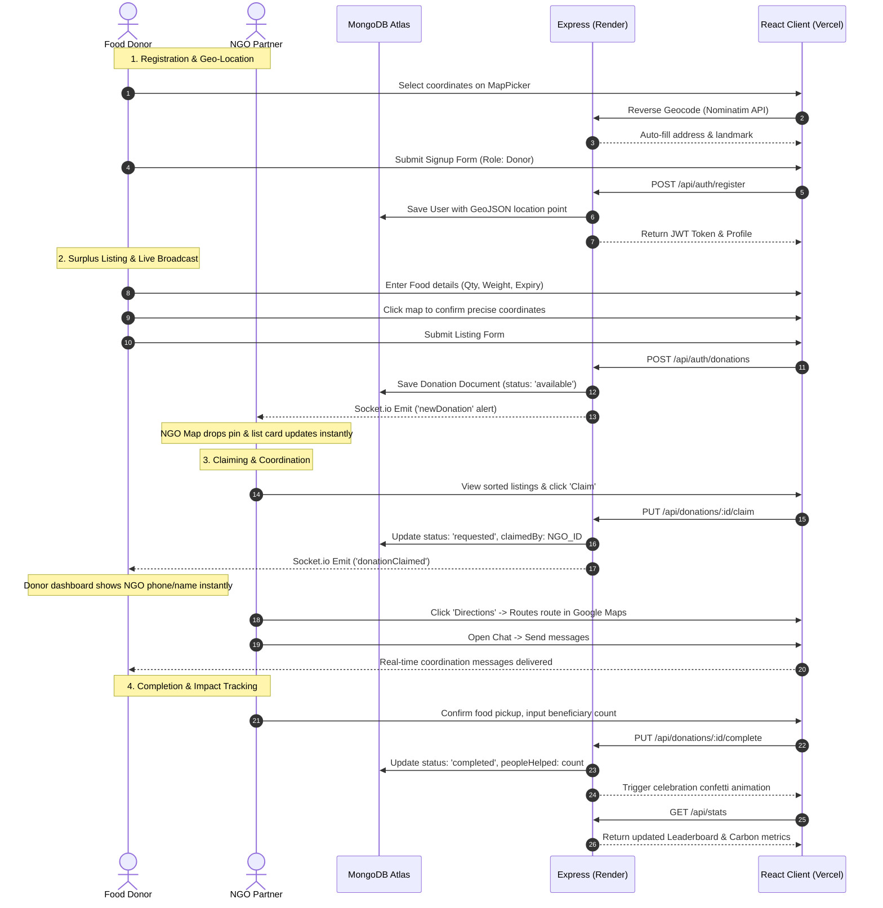

# 🌱 EcoConnect — Food Donation & Resource Sharing Platform

EcoConnect is a dynamic, real-time web application designed to bridge surplus food from donors (hotels, hostlers, restaurants, and households) with local NGO volunteers to feed communities in need and reduce carbon footprint. 

The platform is built with a premium dark-themed aesthetic, dynamic SVG impact visualizations, and is fully compliant with UN Sustainable Development Goals (SDG 2: Zero Hunger, SDG 11: Sustainable Cities, SDG 12: Responsible Consumption, SDG 13: Climate Action, and SDG 17: Partnerships).

---

## 🚀 Key Features & Optimizations

*   **Geospatial Proximity Match (`2dsphere` Indexes)**: Leverages MongoDB's geospatial queries (`$near` operators) to retrieve and display food listings sorted by proximity to the logged-in NGO's base.
*   **Nominatim Reverse Geocoding**: Features a Leaflet coordinate picker. When a user clicks or drags a map pin during registration or listing, it fetches and auto-fills the nearest street address from the OpenStreetMap Nominatim API in real-time.
*   **Double-Sided Live Synchronization (Socket.io)**: 
    *   *Real-time Broadcasts*: Newly listed food items drop onto nearby NGOs' maps instantly without page reloads.
    *   *Live Claim Notifications*: Donors receive instant popup alerts when an NGO claims their listing.
    *   *Global Release Alerts*: If an NGO releases a claimed item due to transit issues, all other online NGOs receive a global warning alert to step in and claim the listing.
*   **Direct Google Maps Navigation**: Claimed listings show a `🗺️ Directions` link that maps routes from the volunteer's current coordinates directly to the donor's coordinates in Google Maps.
*   **Direct Coordination Chat**: An instant, room-isolated chat thread opens for active coordination between the donor and claiming NGO.
*   **Gamified Impact Dashboard**: Converts saved food weight into carbon emissions avoided (kg CO2) and beneficiary meals delivered, updating leaderboards and visual metrics dynamically.

---

## 🗺️ Project Workflows & System Flow



---

## 🛠️ Technology Stack

*   **Frontend**: React.js (Vite), Vanilla CSS (Glassmorphism design tokens), Leaflet & OpenStreetMap, Lucide React icons, Canvas-Confetti.
*   **Backend**: Node.js, Express.js, Socket.io (WebSocket server wrapper), JWT (Authentication), Morgan (Logger).
*   **Database**: MongoDB Atlas, Mongoose (Schemas, GeoJSON indexes, population middlewares).

---

## 📂 Project Directory Structure

```text
ecoconnect/
├── backend/
│   ├── config/             # Database connection setup
│   ├── controllers/        # Express handlers (auth, donations, stats)
│   ├── middleware/         # JWT validation & role permissions
│   ├── models/             # Mongoose schemas (User, Donation)
│   ├── routes/             # API routes
│   ├── .env                # Private database configuration parameters
│   └── server.js           # Server boot & Socket.io wrapper
├── frontend/
│   ├── src/
│   │   ├── components/     # Reusable layout cards, maps, chats, modals
│   │   ├── context/        # Auth context, fetch helper & Socket listeners
│   │   ├── pages/          # Dashboards (NGO & Donor), Impact, Profile
│   │   ├── App.jsx         # State-based layout page router
│   │   └── index.css       # Core design tokens and custom animations
│   ├── .npmrc              # Vercel conflict dependency rules
│   └── vite.config.js
├── package.json            # Root configuration scripts
└── README.md
```

---

## 💻 Local Setup & Installation

Follow these steps to run the application locally on your machine:

1.  **Clone the Repository**:
    ```bash
    git clone https://github.com/sudeepdandavati/ecoconnect.git
    cd ecoconnect
    ```

2.  **Install Dependencies**:
    Run the root script to install root, backend, and frontend dependencies in a single step:
    ```bash
    npm run install-all
    ```

3.  **Environment Variables Setup**:
    Create a `.env` file inside the `backend` directory:
    ```env
    PORT=5000
    MONGO_URI=mongodb+srv://<username>:<password>@cluster0.mongodb.net/databaseName
    JWT_SECRET=your_super_secret_jwt_key
    ```

4.  **Run in Local Development Mode**:
    Start both Vite dev server (port 5173) and backend node server (port 5000) concurrently:
    ```bash
    npm run dev
    ```
    Open your browser and navigate to `http://localhost:5173/`.

---

## 🌐 Production Deployment Guide

EcoConnect is optimized to run as a **decoupled application** (Frontend on Vercel, Backend on Render).

### 1. Backend Deployment (Render)
1.  Sign in to [Render](https://render.com/) and create a new **Web Service**.
2.  Connect your GitHub repository.
3.  Configure settings:
    *   **Root Directory**: `backend`
    *   **Build Command**: `npm install`
    *   **Start Command**: `node server.js`
4.  Add **Environment Variables**:
    *   `MONGO_URI` = `your_mongodb_atlas_connection_string`
    *   `JWT_SECRET` = `your_jwt_secret_key`
    *   `NODE_ENV` = `production`
5.  Deploy and copy your backend URL (e.g., `https://ecoconnect-backend.onrender.com`).

*Note: Ensure your MongoDB Atlas cluster has network access set to **Allow Access from Anywhere (`0.0.0.0/0`)** so Render's cloud servers can connect.*

### 2. Frontend Deployment (Vercel)
1.  Sign in to [Vercel](https://vercel.com/) and click **Add New > Project**.
2.  Import your GitHub repository.
3.  Configure settings:
    *   **Framework Preset**: `Vite`
    *   **Root Directory**: `frontend`
4.  Add **Environment Variables**:
    *   `VITE_API_URL` = `https://ecoconnect-backend.onrender.com/api` (Points to Render)
    *   `VITE_SOCKET_URL` = `https://ecoconnect-backend.onrender.com`
5.  Click **Deploy**. Once built, Vercel will host the fast React client.

---

## 📄 License
This initiative is open-source. Feel free to fork, expand, and contribute! ♻️
